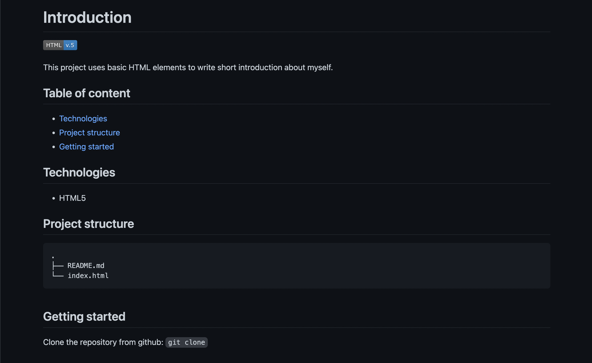

# Introduction to basic HTML

Practice Git CLI, basic HTML elements and build short introduction about yourself.

## Requirement

Edit the codes in `index.html` and create a webpage to introduce yourself similar to
[this sample](https://integrify-finland.github.io/bof-introduction-sample/)

1. Make use of different tags: headings, paragraphs, link, italic, ordered list, unordered list,table, form
2. Check out more tags that might be helpful: address, section, article, audio
3. Make sure you do not leave unnecessary while space in your codes
Styling is not needed for this assignment
4. Deploy your code base into any hosting platform of your choice. Rewrite README file to describe your project with few more details.

